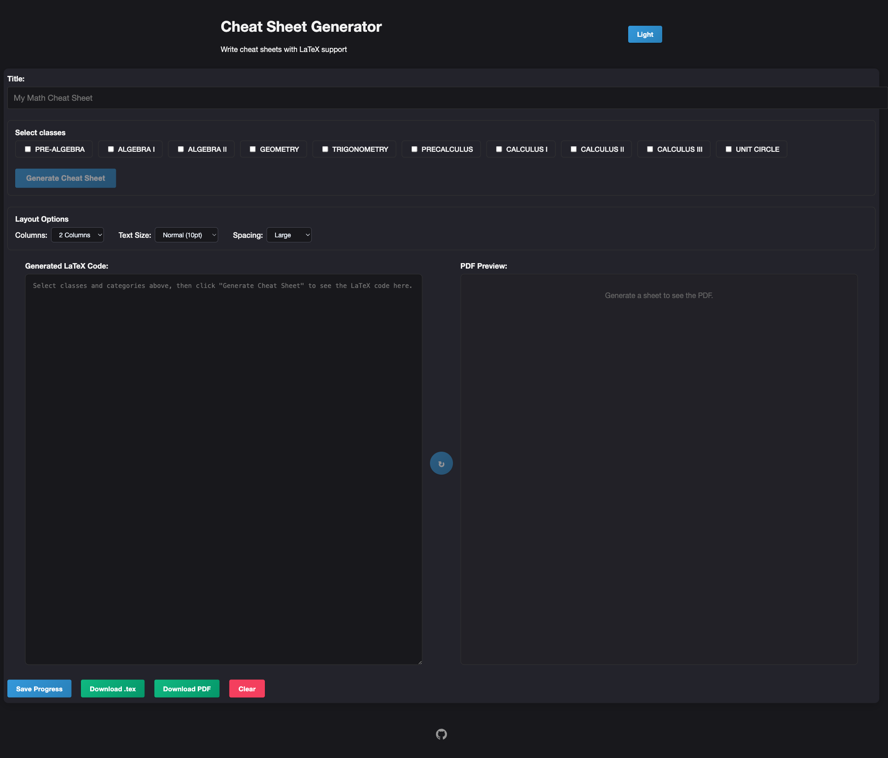

# Cheat Sheet Generator

<p align="center">
  
</p>

<p align="center">
  Full-stack React + Django editor for building LaTeX cheat sheets with live PDF preview, local draft recovery, account-backed saves, compile snapshots, and section-based YouTube study picks.
</p>

<p align="center">
  <a href="https://github.com/ChicoState/cheat-sheet/actions/workflows/ci.yml"></a>
  <a href="https://chicostate.github.io/cheat-sheet/"></a>
  
  
  
  
  
  
  
  
</p>

<p align="center">
  <a href="#overview">Overview</a> •
  <a href="#current-editor-ui">Current Editor UI</a> •
  <a href="#features">Features</a> •
  <a href="#architecture">Architecture</a> •
  <a href="#project-structure">Project Structure</a> •
  <a href="#getting-started">Getting Started</a> •
  <a href="#api-endpoints">API Endpoints</a> •
  <a href="#checks-and-validation">Checks and Validation</a>
</p>



## Overview

Cheat Sheet Generator is a study-sheet editor for math-heavy classes. Users can pick classes and categories, generate starter LaTeX from the formula library, tune layout settings, preview compiled output, restore prior compile snapshots, and export the result as PDF or `.tex`.

The app is split into:

- a **React + Vite frontend** for the editor, dashboard, auth screens, preview controls, and resource rail
- a **Django REST API** for formula generation, persistence, JWT auth, and PDF compilation
- a **Docker Compose setup** for local full-stack development with PostgreSQL

## Current Editor UI

The main editor is a three-region workspace:

### Left rail

- class checklist
- section/category toggles
- drag-and-drop formula ordering grouped by class
- layout controls for columns, text size, spacing, and margins
- primary actions for compile, save, reset, and downloads

### Center workspace

- top toolbar with subject toggle, snapshot toggle, save, print, and preview rebuild actions
- optional split view with LaTeX editor on one side and compiled PDF preview on the other
- PDF preview controls for zoom in/out, reset, fit width, fit height, and print
- animated recompilation overlay while the preview refreshes

### Right rail

- section-aware YouTube recommendations
- one top YouTube result per selected category
- grouped display by class with inline thumbnails and modal playback

## Features

### Editing and generation

- formula library spanning pre-algebra through calculus
- category-based formula picking
- drag-and-drop ordering for classes and formulas
- generated LaTeX editing in-browser
- compile through the backend with Tectonic
- PDF preview with button-driven zoom controls
- print support from the current compiled PDF

### Layout controls

- **1 to 5 columns**
- preset and custom font sizing
- preset and custom spacing
- adjustable page margins
- automatic preview rebuild after layout-only changes

### Persistence and recovery

- browser-local draft persistence for the active sheet
- account-backed save/load for signed-in users
- local compile snapshots for the active draft
- snapshot restore flow that repopulates the editor and rebuilds preview on reopen
- local-only save success message when the user is not signed in

### UI workflow

- resizable left rail, LaTeX pane, and right rail
- hide/show subject rail without losing access to save/compile controls
- responsive layout cleanup for tighter desktop widths and smaller screens
- compile-state loading shell for preview refreshes

### Study resources

- backend-proxied YouTube search so the API key never reaches the browser
- repo-root `YOUTUBE_API_KEY` support for local runs and Docker Compose passthrough
- request validation and error handling for missing key, invalid topics, empty results, and upstream failures

## Tech stack

| Layer | Technology |
| --- | --- |
| Frontend | React 18, Vite 6, react-pdf, dnd-kit, lucide-react, framer-motion |
| Backend | Django 6, Django REST Framework, Simple JWT |
| PDF pipeline | Tectonic |
| Database | SQLite by default, PostgreSQL in Docker |
| Tooling | Docker Compose, ESLint, Vitest, Pytest, Ruff |

## Architecture

```text
Frontend (React + Vite)
  ├─ Auth + dashboard routes
  ├─ Formula selection and ordering UI
  ├─ Layout controls + LaTeX editor
  ├─ PDF preview and export actions
  └─ YouTube resource rail
         │
         ▼
Backend (Django + DRF)
  ├─ JWT auth + registration
  ├─ Formula/class metadata
  ├─ LaTeX generation endpoint
  ├─ LaTeX compile + normalize endpoint
  ├─ YouTube resource proxy endpoint
  └─ Template / cheat sheet / problem CRUD
```

## Project structure

```text
.
├── backend/
│   ├── api/
│   │   ├── formula_data/          # Class/category/formula source data
│   │   ├── models.py              # Template, CheatSheet, PracticeProblem
│   │   ├── serializers.py         # DRF serializers
│   │   ├── tests.py               # Backend API and compile tests
│   │   ├── urls.py                # API routes
│   │   └── views.py               # Generation, compile, resource, CRUD views
│   ├── cheat_sheet/
│   │   ├── settings.py            # Django settings + env loading
│   │   └── urls.py
│   ├── Dockerfile
│   ├── manage.py
│   └── requirements.txt
├── frontend/
│   ├── public/
│   ├── src/
│   │   ├── components/            # Editor, dashboard, auth, UI components
│   │   ├── context/               # Auth context
│   │   ├── hooks/                 # Formula, latex, YouTube resource hooks
│   │   ├── App.css                # Main application styling
│   │   └── App.jsx                # Routing, shell, save workflow
│   ├── Dockerfile
│   ├── package.json
│   └── vite.config.js
├── docs/                          # Static/project-page assets
├── .github/workflows/             # CI workflows
├── docker-compose.yml
├── current-ui.png
└── README.md
```

## Getting started

### Prerequisites

- Node.js 24+
- Python 3.14+
- Tectonic
- Docker Desktop or equivalent container runtime

### Environment

The backend reads both, with `/backend/.env` taking precedence over repo-root defaults:

- `/.env`
- `/backend/.env`

For YouTube suggestions, add this in the repo-root `.env`:

```dotenv
YOUTUBE_API_KEY=your_key_here
```

Docker Compose passes `YOUTUBE_API_KEY` into the backend container from the repo-root `.env` (or from your shell environment), so the same key works in local Django runs and containers without mounting the whole root `.env` file into the container.

### Backend setup

```bash
cd backend
python -m venv venv
source venv/bin/activate
pip install -r requirements.txt
python manage.py migrate
python manage.py runserver
```

Backend URL:

```text
http://localhost:8000/api/
```

### Frontend setup

```bash
cd frontend
npm install
npm run dev
```

Frontend URL:

```text
http://localhost:5173/
```

### Full stack with Docker

```bash
docker compose up --build
```

Services:

- frontend: `http://localhost:5173`
- backend: `http://localhost:8000/api/`
- postgres: internal Compose service used by Django

## Editor workflow

1. Select one or more classes.
2. Toggle the categories you want included.
3. Reorder class groups or formulas if needed.
4. Generate/compile the sheet.
5. Adjust columns, spacing, font size, or margins.
6. Rebuild the preview or let layout-only changes trigger recompilation.
7. Save locally or, if signed in, save to your account.
8. Restore a compile snapshot if you want to jump back to an earlier draft.
9. Export `.pdf` / `.tex` or print directly from the preview toolbar.

## API endpoints

### Authentication and health

| Method | Endpoint | Description |
| --- | --- | --- |
| GET | `/api/health/` | Service health check |
| POST | `/api/register/` | Register a new user |
| POST | `/api/token/` | Obtain JWT access and refresh tokens |
| POST | `/api/token/refresh/` | Refresh JWT access token |

### Editor and compilation

| Method | Endpoint | Description |
| --- | --- | --- |
| GET | `/api/classes/` | List classes, categories, and formulas |
| POST | `/api/generate-sheet/` | Generate LaTeX from selected formulas |
| POST | `/api/compile/` | Normalize and compile LaTeX into PDF |
| POST | `/api/youtube-resources/` | Return top YouTube picks for selected sections |

### Persistence

| Method | Endpoint | Description |
| --- | --- | --- |
| GET / POST | `/api/templates/` | List or create templates |
| GET / PUT / PATCH / DELETE | `/api/templates/{id}/` | Retrieve or modify a template |
| GET / POST | `/api/cheatsheets/` | List or create cheat sheets |
| GET / PUT / PATCH / DELETE | `/api/cheatsheets/{id}/` | Retrieve or modify a cheat sheet |
| GET / POST | `/api/problems/` | List or create practice problems |
| GET / PUT / PATCH / DELETE | `/api/problems/{id}/` | Retrieve or modify a practice problem |

## Available formula coverage

- PRE-ALGEBRA
- ALGEBRA I
- ALGEBRA II
- GEOMETRY
- TRIGONOMETRY
- PRECALCULUS
- CALCULUS I
- CALCULUS II
- CALCULUS III
- UNIT CIRCLE

Each class contains multiple categories and formulas in `backend/api/formula_data/`.

## Checks and validation

### Frontend

```bash
cd frontend
npx eslint src
npm test -- --run
npm run build
```

### Backend

```bash
cd backend
python manage.py check
pytest -v
ruff check .
```

### Docker

```bash
docker compose config
docker compose build
```

## CI pipeline

GitHub Actions verifies:

- frontend install and build
- backend lint/tests
- container build health

## Development notes

### Add a new API endpoint

1. Add the view in `backend/api/views.py`
2. Register the route in `backend/api/urls.py`
3. Add or update serializers if needed
4. Cover it in `backend/api/tests.py`

### Add formula content

Update the appropriate file under `backend/api/formula_data/`.

## Community

- [Code of Conduct](CODE_OF_CONDUCT.md)
- [Contributing Guide](CONTRIBUTING.md)
- [Security Policy](SECURITY.md)

## Contributing

Open issues or pull requests if you want to improve formula coverage, editor workflow, tests, or docs. For repo workflow expectations, see [CONTRIBUTING.md](CONTRIBUTING.md).

## Security

If you find a vulnerability, follow [SECURITY.md](SECURITY.md) instead of opening a public issue.

## License

No license file is currently included in this repository.
