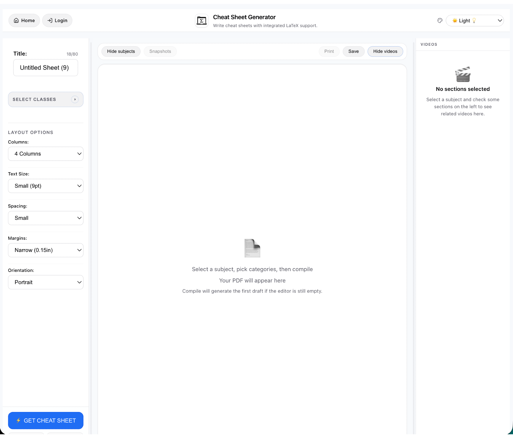

# Cheat Sheet Generator

<p align="center">
  
</p>

<p align="center">
  Full-stack React + Django editor for building dense LaTeX cheat sheets with CodeMirror editing, live PDF preview, local draft recovery, account-backed saves, compile snapshots, and section-based YouTube study picks.
</p>

<p align="center">
  <a href="https://github.com/ChicoState/cheat-sheet/actions/workflows/ci.yml"></a>
  
  
  
  
  
  
  
  
</p>

<p align="center">
  <a href="#overview">Overview</a> •
  <a href="#current-editor-ui">Current Editor UI</a> •
  <a href="#features">Features</a> •
  <a href="#architecture">Architecture</a> •
  <a href="#project-structure">Project Structure</a> •
  <a href="#getting-started">Getting Started</a> •
  <a href="#api-endpoints">API Endpoints</a> •
  <a href="#checks-and-validation">Checks and Validation</a>
</p>



## Overview

Cheat Sheet Generator is a study-sheet editor for math-heavy classes. Users can pick classes and categories, generate starter LaTeX from the formula library, tune layout settings, preview compiled output, restore prior compile snapshots, and export the result as PDF or `.tex`.

The app is split into:

- a **React + Vite frontend** for the editor, dashboard, auth screens, preview controls, and resource rail
- a **Django REST API** for formula generation, persistence, JWT auth, and PDF compilation
- a **Docker Compose setup** for local full-stack development with PostgreSQL

## Current Editor UI

The current editor is a three-panel workspace built around the compiled PDF. The subject picker stays on the left, the PDF preview stays in the center, and study videos stay on the right. The LaTeX source editor is available when needed, but it no longer dominates the first view.

### Left subject rail

- Title field with an 80-character counter and automatic starter titles from selected classes.
- Class and section selectors with collapsible cards; there is no global “Select All” action.
- Selected formulas grouped by class, with drag-and-drop ordering and per-formula remove buttons.
- Layout controls for columns, text size, spacing, margins, and portrait/landscape orientation.
- Main `GET CHEAT SHEET` compile button with Ctrl+Enter shortcut text.
- Back/Forward draft history, save, clear, print, PDF download, and `.tex` download controls.

### Center PDF workspace

- Toolbar buttons to hide/show subjects, open saved compile snapshots, show/hide the LaTeX editor, print, save, and hide/show videos.
- PDF-first layout: before compile, the center shows a placeholder; after compile, it focuses on the generated PDF.
- Optional split view: opening the LaTeX editor places CodeMirror on the left side of the center workspace and the PDF preview on the right.
- Resizable LaTeX split so users can give more room to either source code or preview.
- Preview controls for zoom out, zoom in, reset, fit width, fit height, current page, and scroll-to-top.
- Recompile overlay while layout changes or content changes refresh the PDF.
- Compile errors appear as a readable summary above the editor/preview instead of leaving users to scan raw LaTeX output first.

### Right video rail

- Compact section-aware video recommendations based on the selected class/category.
- Curated videos shown first, one per selected section by default.
- Section-level expansion and per-section “search more” behavior when curated links are not enough.
- YouTube API searches stay behind the backend proxy; the browser never receives the API key.
- Inline thumbnails open in an accessible modal, and Escape closes the video modal.

### Workspace behavior

- Left and right rails can be hidden from the center toolbar and resized with drag handles.
- The first successful compile narrows the subject rail so the PDF gets more space while keeping controls reachable.
- Panel widths and selected class/section collapse state persist across returns to the editor.
- Saves use the latest live editor draft, even while CodeMirror state is debounced for smoother typing.
- Successful compiles create local snapshots that can restore title, layout, selected formulas, source, and preview state.

## Features

### Recent updates

- CodeMirror 6 LaTeX editor with a calmer Tokyo Night syntax theme, real editor behavior, and lazy loading so the main bundle stays smaller
- automatic add/remove syncing between sidebar formula selections and edited LaTeX, using backend-managed formula markers that preserve manual notes where possible
- strict formula-merge validation so stale or unresolved selections fail clearly instead of silently dropping formulas
- landscape orientation support across save, restore, compile, and dashboard download flows
- compact layout presets for dense math sheets, including 6pt text, 0.1in margins, and tighter display-math spacing
- first successful compile collapses class/section selection while leaving formula reorder controls available
- selected class/section collapse state persists across page returns and snapshot changes
- Back/Forward history now includes the first generated sheet from an empty editor
- curated class/section video links with compact right-rail cards and API search kept as a per-section fallback
- Algorithms, Chemistry, Discrete Math, Statistics, and Linear Algebra formula/video coverage expanded
- clearer unresolved-formula messages that explain when the current LaTeX was left unchanged
- keyboard shortcuts: Ctrl+Enter to compile, Ctrl+S to save, Escape to close the video modal
- browser tab title reflects the active cheat sheet name
- title character counter with an 80-character limit
- last-saved timestamp next to the save button
- scroll-to-top and page-number controls in the PDF preview
- focus ring, muted-text contrast, and compact panel styling improvements

### Editing and generation

- formula library spanning pre-algebra through calculus
- category-based formula picking
- drag-and-drop ordering for classes and formulas
- generated LaTeX editing in-browser with CodeMirror 6 and LaTeX syntax highlighting
- compile through the backend with Tectonic
- PDF preview with button-driven zoom controls
- print support from the current compiled PDF
- first compile narrows the subject rail to its minimum width so the preview has more room

### Layout controls

- **1 to 5 columns**
- preset and custom font sizing, including a 6pt minimum preset for dense reference sheets
- preset and custom spacing, including 0pt / 0.2pt compact spacing options
- adjustable page margins, including a 0.1in minimum preset
- portrait and landscape orientation
- automatic preview rebuild after layout-only changes

### Persistence and recovery

- browser-local draft persistence for the active sheet
- account-backed save/load for signed-in users
- local compile snapshots for the active draft
- snapshot restore flow that repopulates the editor and rebuilds preview on reopen
- local-only save success message when the user is not signed in
- persisted successful-compile state so reopened compiled sheets do not repeat first-compile collapse behavior

### UI workflow

- resizable left rail, LaTeX pane, and right rail
- hide/show subject and video rails from the toolbar
- LaTeX editor hidden by default after compile to keep the PDF preview as the main focus
- responsive layout cleanup for tighter desktop widths and smaller screens
- compile-state loading shell for preview refreshes

### Study resources

- backend-proxied YouTube search so the API key never reaches the browser
- repo-root `YOUTUBE_API_KEY` support for local runs and Docker Compose passthrough
- curated class/section links in `frontend/src/data/subjectVideos.js` shown before any API call
- section-scoped “search more” behavior so the YouTube API is a last-resort fallback for the clicked section only
- request validation and error handling for missing key, invalid topics, empty results, and upstream failures

### Themes
- Light Mode
- Dark Mode
- Miami Theme
- Forest Theme
- Cool Gray Theme
- Neon Theme
- Galaxy Theme
- Red Theme
- Pink 'Blossom' Inspired Theme

## Tech stack

| Layer | Technology |
| --- | --- |
| Frontend | React 18, Vite 6, CodeMirror 6, react-pdf, dnd-kit, lucide-react, framer-motion |
| Backend | Django 6, Django REST Framework, Simple JWT |
| PDF pipeline | Tectonic |
| Database | SQLite by default, PostgreSQL in Docker |
| Tooling | Docker Compose, ESLint, Vitest, Pytest, Ruff |

## Architecture

```text
Frontend (React + Vite)
  ├─ Auth + dashboard routes
  ├─ Formula selection and ordering UI
  ├─ Layout controls + CodeMirror LaTeX editor
  ├─ PDF preview and export actions
  └─ YouTube resource rail
         │
         ▼
Backend (Django + DRF)
  ├─ JWT auth + registration
  ├─ Formula/class metadata
  ├─ LaTeX generation endpoint
  ├─ LaTeX compile + normalize endpoint
  ├─ YouTube resource proxy endpoint
  └─ Template / cheat sheet / problem CRUD
```

## Project structure

```text
.
├── backend/
│   ├── api/
│   │   ├── formula_data/          # Class/category/formula source data
│   │   ├── models.py              # Template, CheatSheet, PracticeProblem
│   │   ├── serializers.py         # DRF serializers
│   │   ├── tests.py               # Backend API and compile tests
│   │   ├── urls.py                # API routes
│   │   └── views.py               # Generation, compile, resource, CRUD views
│   ├── cheat_sheet/
│   │   ├── settings.py            # Django settings + env loading
│   │   └── urls.py
│   ├── Dockerfile
│   ├── manage.py
│   └── requirements.txt
├── frontend/
│   ├── public/
│   ├── src/
│   │   ├── components/            # Editor, dashboard, auth, UI components
│   │   ├── context/               # Auth context
│   │   ├── data/                  # Curated study video links
│   │   ├── hooks/                 # Formula, latex, YouTube resource hooks
│   │   ├── App.css                # Main application styling
│   │   └── App.jsx                # Routing, shell, save workflow
│   ├── Dockerfile
│   ├── package.json               # Frontend deps, including CodeMirror editor packages
│   └── vite.config.js
├── .github/workflows/             # CI workflows
├── docker-compose.yml
├── current-ui.png
└── README.md
```

## Getting started

### Prerequisites

- Node.js 24+
- Python 3.14+
- Tectonic 0.15+ locally, or the Tectonic binary installed by the backend Docker image
- Docker Desktop or equivalent container runtime

### Environment

The backend reads both, with `/backend/.env` taking precedence over repo-root defaults:

- `/.env`
- `/backend/.env`

For YouTube suggestions, add this in the repo-root `.env`:

```dotenv
YOUTUBE_API_KEY=your_key_here
```

Docker Compose passes `YOUTUBE_API_KEY` into the backend container from the repo-root `.env` (or from your shell environment), so the same key works in local Django runs and containers without mounting the whole root `.env` file into the container.

### Backend setup

```bash
cd backend
python -m venv venv
source venv/bin/activate
pip install -r requirements.txt
python manage.py migrate
python manage.py runserver
```

Backend URL:

```text
http://localhost:8000/api/
```

### Frontend setup

```bash
cd frontend
npm install
npm run dev
```

Frontend URL:

```text
http://localhost:5173/
```

### Full stack with Docker

```bash
docker compose up --build
```

Services:

- frontend: `http://localhost:5173`
- backend: `http://localhost:8000/api/`
- postgres: internal Compose service used by Django

The frontend Docker image runs the Vite dev server and uses `npm ci`, so `frontend/package-lock.json` must stay committed when dependencies change. The backend image installs `backend/requirements.txt`, downloads Tectonic, warms the Tectonic cache, and runs migrations before starting Django.

## Editor workflow

1. Select one or more classes.
2. Toggle the categories you want included.
3. Reorder class groups or formulas if needed.
4. Generate/compile the sheet.
5. Adjust columns, spacing, font size, or margins.
6. Open the CodeMirror LaTeX editor if you need to inspect or edit the generated source.
7. Save locally or, if signed in, save to your account.
8. Restore a compile snapshot if you want to jump back to an earlier draft.
9. Export `.pdf` / `.tex` or print directly from the preview toolbar.

When selected formulas change after manual LaTeX edits, compile syncs the selected formulas into the current document instead of regenerating the whole sheet. Managed formula blocks use hidden markers. Still-selected formula blocks and manual notes are preserved where possible; deselected managed formula blocks are removed. If a selected formula cannot be resolved exactly during this merge, the compile is blocked and the current LaTeX is left unchanged.

## API endpoints

### Authentication and health

| Method | Endpoint | Description |
| --- | --- | --- |
| GET | `/api/health/` | Service health check |
| POST | `/api/register/` | Register a new user |
| POST | `/api/token/` | Obtain JWT access and refresh tokens |
| POST | `/api/token/refresh/` | Refresh JWT access token |

### Editor and compilation

| Method | Endpoint | Description |
| --- | --- | --- |
| GET | `/api/classes/` | List classes, categories, and formulas |
| POST | `/api/generate-sheet/` | Generate LaTeX from selected formulas |
| POST | `/api/compile/` | Normalize, merge selected formulas when requested, and compile LaTeX into PDF |
| POST | `/api/youtube-resources/` | Return top YouTube picks for selected sections |

### Persistence

| Method | Endpoint | Description |
| --- | --- | --- |
| GET / POST | `/api/templates/` | List or create templates |
| GET / PUT / PATCH / DELETE | `/api/templates/{id}/` | Retrieve or modify a template |
| GET / POST | `/api/cheatsheets/` | List or create cheat sheets |
| GET / PUT / PATCH / DELETE | `/api/cheatsheets/{id}/` | Retrieve or modify a cheat sheet |
| GET / POST | `/api/problems/` | List or create practice problems |
| GET / PUT / PATCH / DELETE | `/api/problems/{id}/` | Retrieve or modify a practice problem |

## Available formula coverage

- PRE-ALGEBRA
- ALGEBRA I
- ALGEBRA II
- GEOMETRY
- TRIGONOMETRY
- PRECALCULUS
- CALCULUS I
- CALCULUS II
- CALCULUS III
- UNIT CIRCLE
- PHYSICS I
- PHYSICS II
- STATISTICS I
- STATISTICS II
- LINEAR ALGEBRA I
- LINEAR ALGEBRA II
- CHEMISTRY I
- CHEMISTRY II
- DISCRETE MATH I
- DISCRETE MATH II
- DATA STRUCTURES & ALGORITHMS I
- DATA STRUCTURES & ALGORITHMS II
- DATA STRUCTURES & ALGORITHMS III

Each class contains multiple categories and formulas in `backend/api/formula_data/`.

## Checks and validation

### Frontend

```bash
cd frontend
npm test -- --run
npm run lint
npm run build
```

### Backend

```bash
cd backend
python manage.py check
python -m pytest
ruff check .
```

For the Docker-backed backend checks used before release:

```bash
docker compose run --rm backend python manage.py check
docker compose run --rm backend pytest -q
docker compose run --rm backend ruff check .
```

### Docker

```bash
docker compose config
docker compose build
```

## CI pipeline

GitHub Actions verifies:

- frontend install and build
- backend lint/tests
- container build verification

## Development notes

### Add a new API endpoint

1. Add the view in `backend/api/views.py`
2. Register the route in `backend/api/urls.py`
3. Add or update serializers if needed
4. Cover it in `backend/api/tests.py`

### Add formula content

Update the appropriate file under `backend/api/formula_data/`.

## Community

- [Code of Conduct](CODE_OF_CONDUCT.md)
- [Contributing Guide](CONTRIBUTING.md)
- [Security Policy](SECURITY.md)

## Contributing

Open issues or pull requests if you want to improve formula coverage, editor workflow, tests, or docs. For repo workflow expectations, see [CONTRIBUTING.md](CONTRIBUTING.md).

## Security

If you find a vulnerability, follow [SECURITY.md](SECURITY.md) instead of opening a public issue.

## License

No license file is currently included in this repository.
